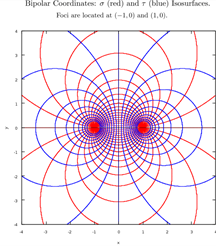
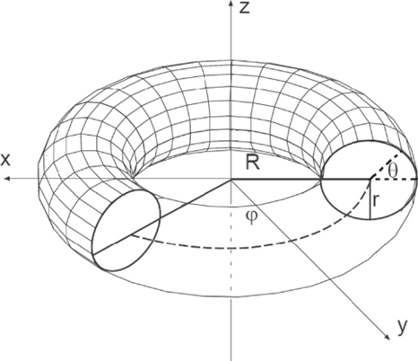
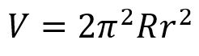
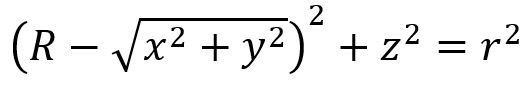
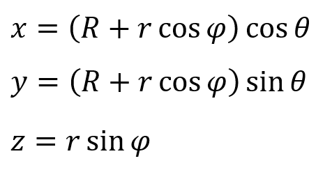
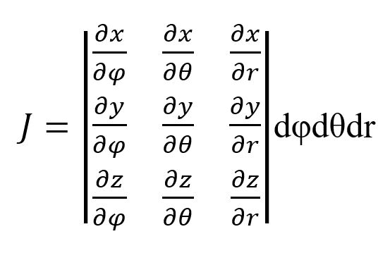
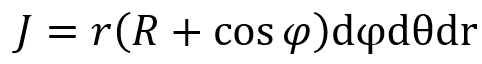
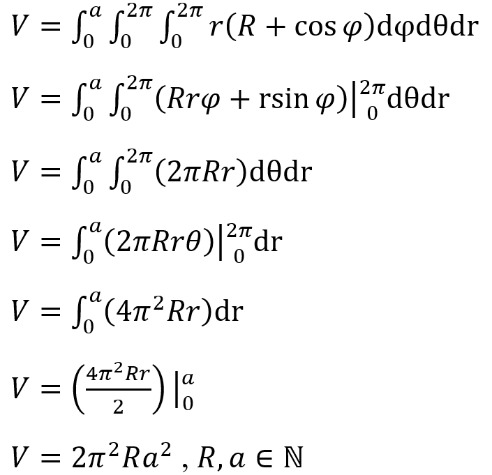

# Toroidal-Coordinates
Toroidal coordinates (σ, τ, φ) are three-dimensional orthogonal coordinate system that results from rotating the two-dimensional bipolar coordinate system (τ, σ). This coordinate system can describe and produce a torus (a donut-like 3-D shapes).

# Torus
A torus is a product of the toroidal coordinate system generated by rotating a circle in a three-dimensional space about an axis that is coplanar with the circle. Provided the axis of revolution does not touch the circle (R > r), the torus will exist as a ring shape (donut) and it is known as torus of revolution.

The toroidal coordinates can be used to compute the volume of a torus by using the Jacobian Method and the Triple Integrals Method.
The formula for volume of torus:

Equation of Torus in Cartesian Coordinates:

With parametric equation of:

# Jacobian Matrix
Volume of Torus can be found by integrating the Jacobian from the parameteric equation of the solid:

Then, the process is continued by using the tiple integrals until it produces the volume formula of torus.

# Triple Integrals

